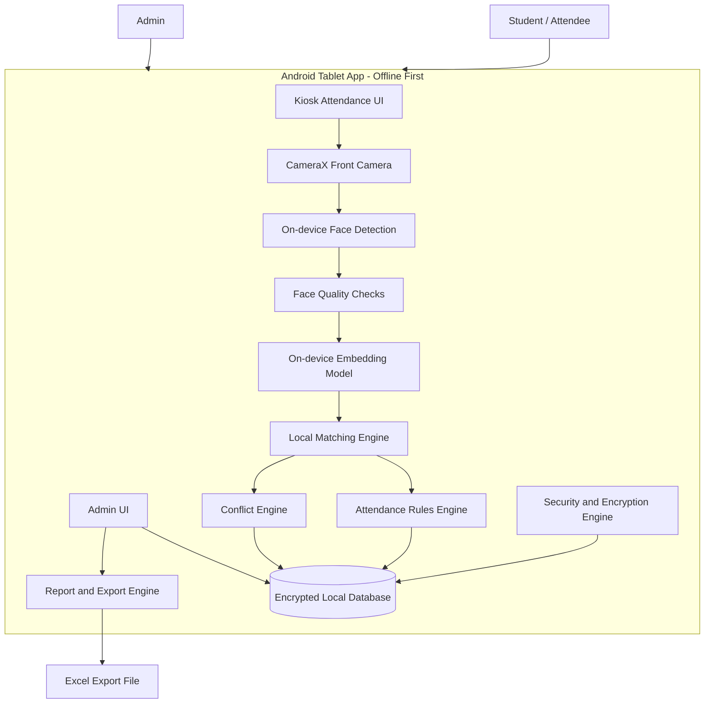
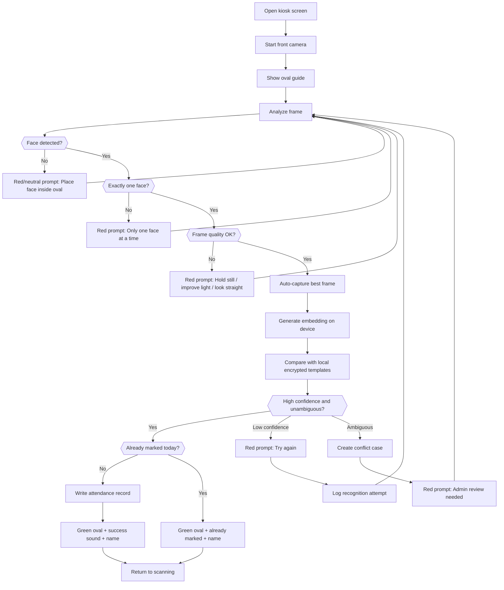
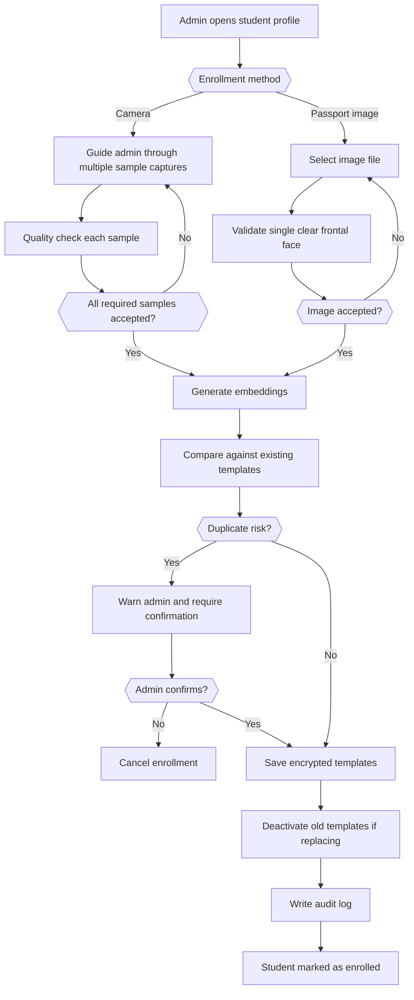
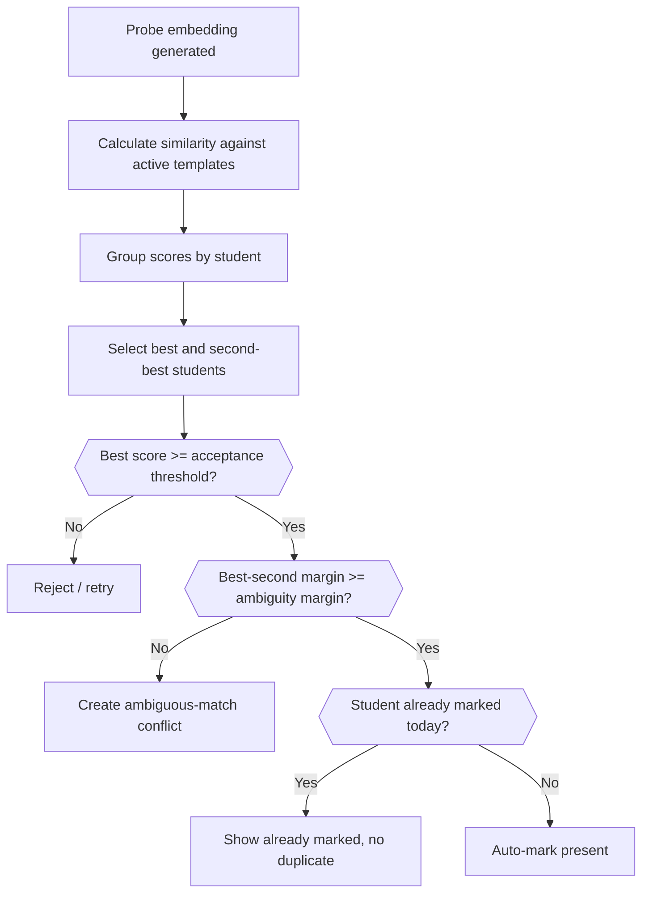
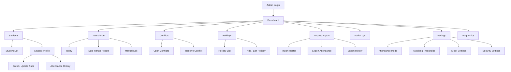
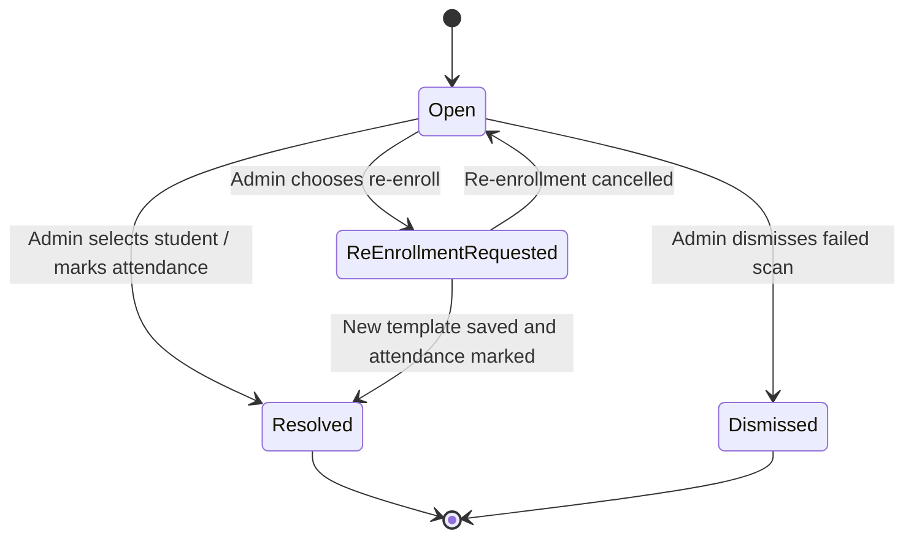
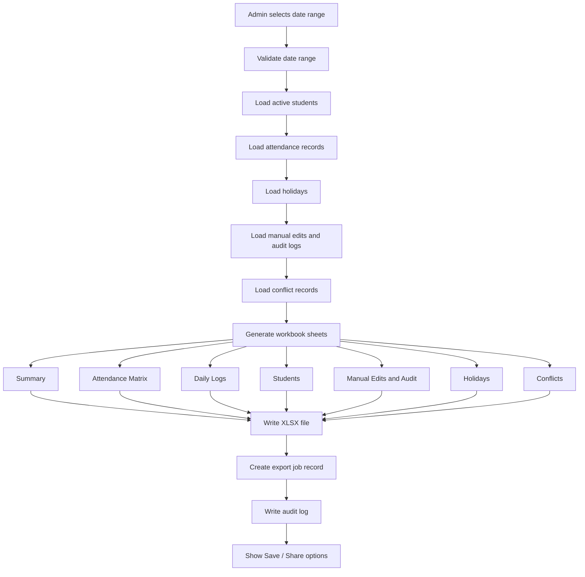
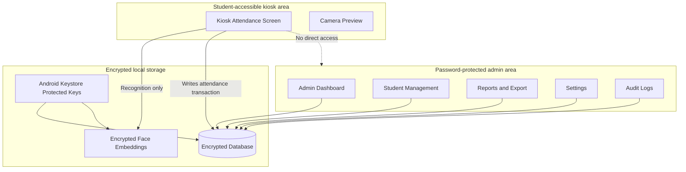
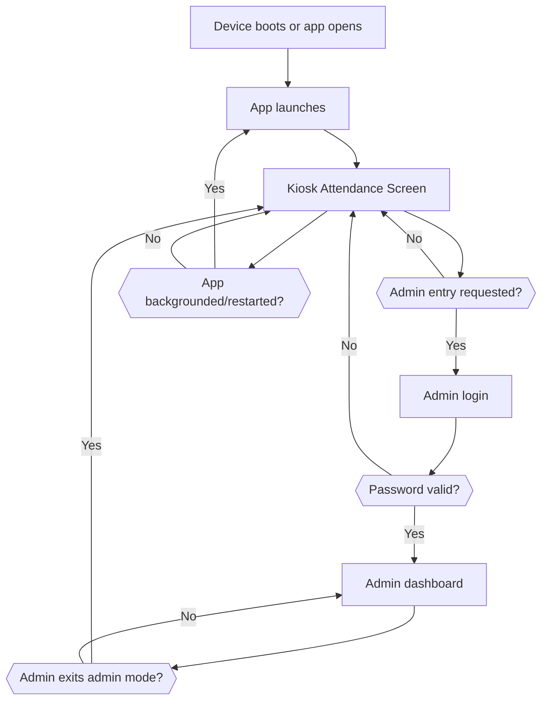

# Diagrams

**Project:** FaceGate Attendance  
**Prepared for:** Internal product and engineering team  
**Prepared on:** 2026-06-04  
**Document status:** Draft for implementation planning

---

## 1. High-level system architecture



---

## 2. Attendance scanning flow



---

## 3. Enrollment flow



---

## 4. Matching decision tree



---

## 5. Admin information architecture



---

## 6. Database ERD

```mermaid
erDiagram
    STUDENTS ||--o{{ FACE_TEMPLATES : has
    STUDENTS ||--o{{ ATTENDANCE_RECORDS : receives
    STUDENTS ||--o{{ CONFLICT_CASES : may_resolve_to
    ATTENDANCE_RECORDS ||--o{{ AUDIT_LOGS : changes_logged_by
    ADMINS ||--o{{ AUDIT_LOGS : performs
    ADMINS ||--o{{ HOLIDAYS : creates
    RECOGNITION_ATTEMPTS ||--o{{ CONFLICT_CASES : creates
    FACE_TEMPLATES ||--o{{ ATTENDANCE_RECORDS : matched_by
    IMPORT_JOBS ||--o{{ AUDIT_LOGS : logged_by
    EXPORT_JOBS ||--o{{ AUDIT_LOGS : logged_by

    STUDENTS {
        string id PK
        string external_student_id
        string full_name
        string group_name
        boolean is_active
        string enrollment_status
        datetime created_at
        datetime updated_at
    }

    FACE_TEMPLATES {
        string id PK
        string student_id FK
        string model_name
        string model_version
        int embedding_dimension
        blob encrypted_embedding
        float quality_score
        string source_type
        boolean is_active
        datetime created_at
    }

    ATTENDANCE_RECORDS {
        string id PK
        string student_id FK
        string attendance_date
        string status
        string source
        float match_score
        string matched_template_id FK
        datetime first_marked_at
        string device_id
    }

    RECOGNITION_ATTEMPTS {
        string id PK
        datetime attempted_at
        string result_type
        string best_student_id
        float best_score
        string second_student_id
        float second_score
        string failure_reason
    }

    CONFLICT_CASES {
        string id PK
        string recognition_attempt_id FK
        string conflict_type
        string status
        string candidate_student_ids
        string resolved_student_id
        string resolved_by_admin_id
        datetime resolved_at
    }

    ADMINS {
        string id PK
        string username
        string password_hash
        string password_salt
        boolean is_active
        datetime last_login_at
    }

    AUDIT_LOGS {
        string id PK
        string admin_id FK
        string action_type
        string entity_type
        string entity_id
        string before_value
        string after_value
        string reason
        datetime created_at
    }

    HOLIDAYS {
        string id PK
        string holiday_date
        string title
        string notes
        string created_by_admin_id FK
    }

    IMPORT_JOBS {
        string id PK
        string file_name
        string import_type
        string status
        int total_rows
        int success_rows
        int failed_rows
    }

    EXPORT_JOBS {
        string id PK
        string export_type
        string date_from
        string date_to
        string file_uri
        string status
    }
```

---

## 7. Conflict lifecycle



---

## 8. Export generation flow



---

## 9. Security boundary diagram



---

## 10. Kiosk mode operational diagram


