# Diagrams

**Project:** RingWave  
**Prepared for:** Internal product and engineering team  
**Prepared on:** 2026-06-06  
**Document status:** Draft for implementation planning

---

## 1. High-level system architecture

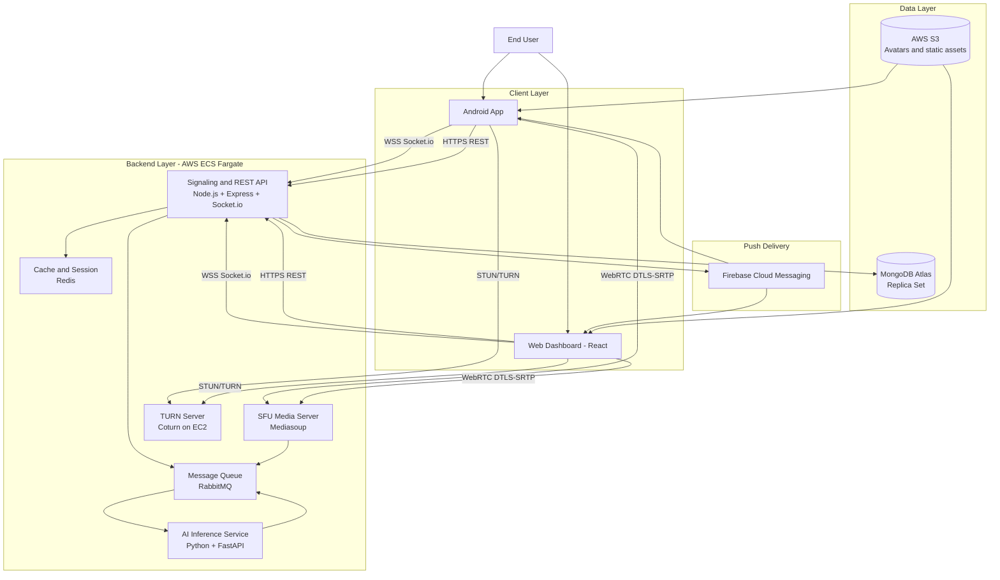

---

## 2. Outgoing one-to-one call signaling flow

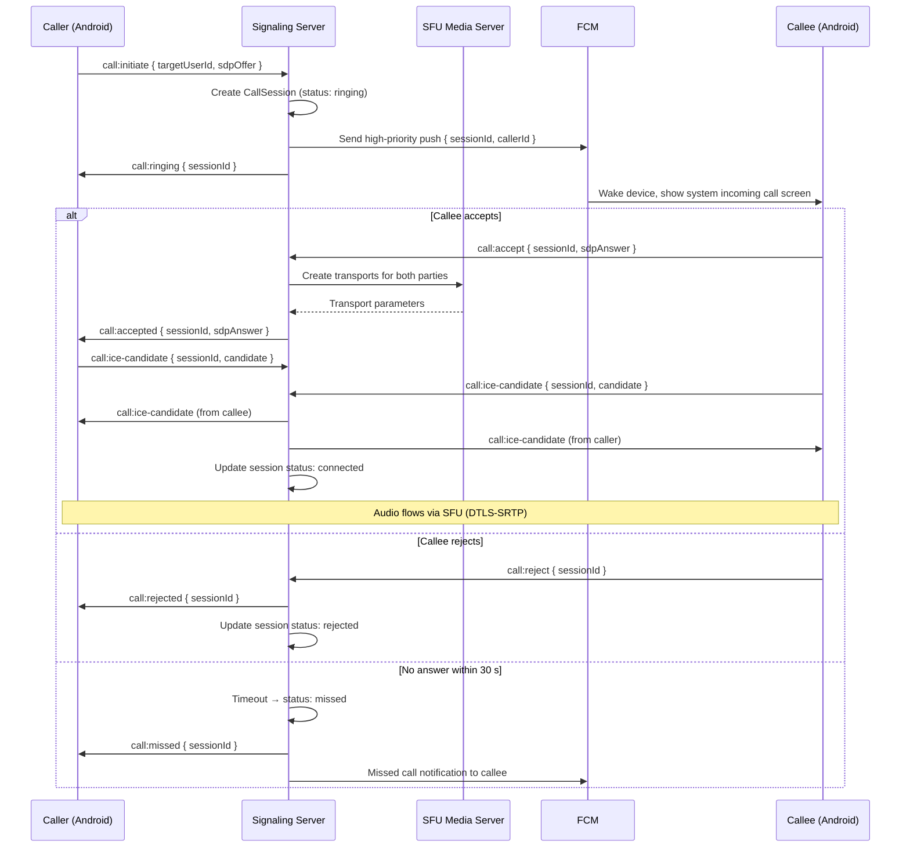

---

## 3. Deepfake detection pipeline flow

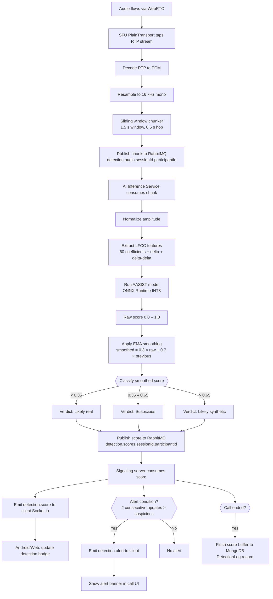

---

## 4. Call state machine

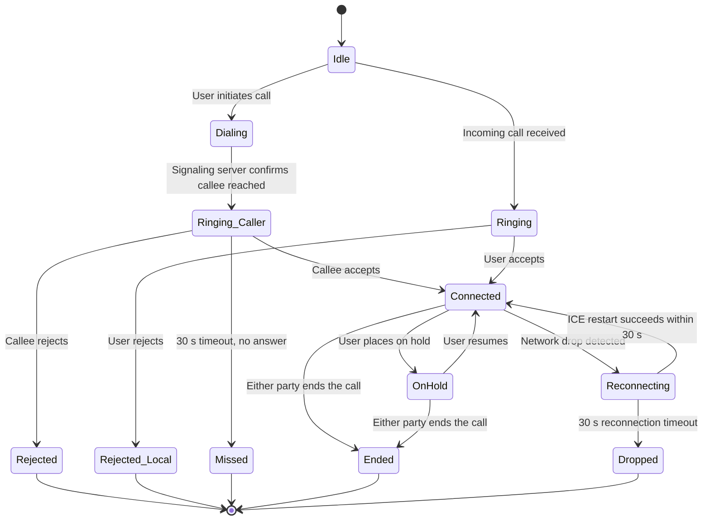

---

## 5. Group call flow

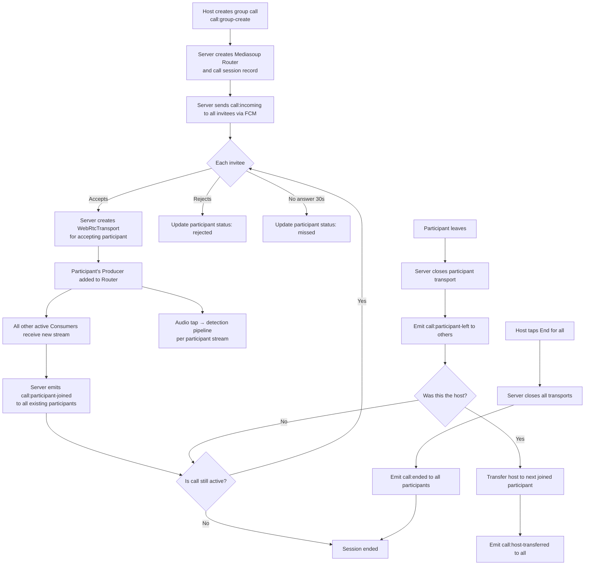

---

## 6. Database entity relationship diagram

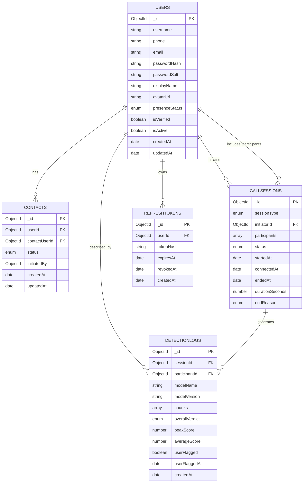

---

## 7. Audio analysis pipeline — component interaction

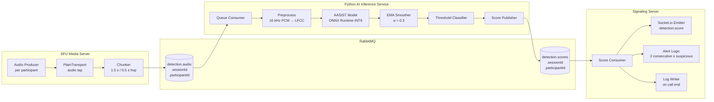

---

## 8. Security boundary diagram

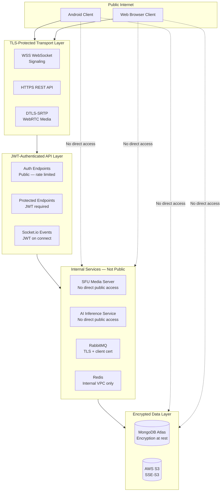

---

## 9. Contact relationship and call initiation permission flow

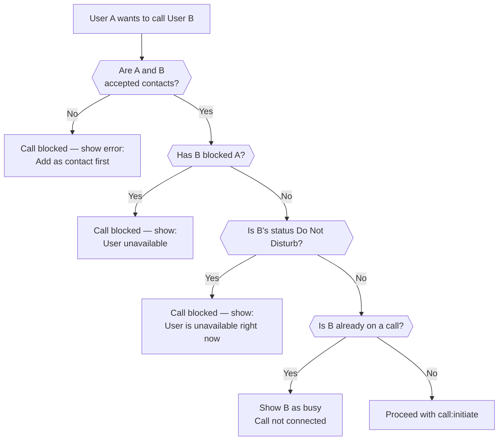

---

## 10. Token lifecycle and refresh flow

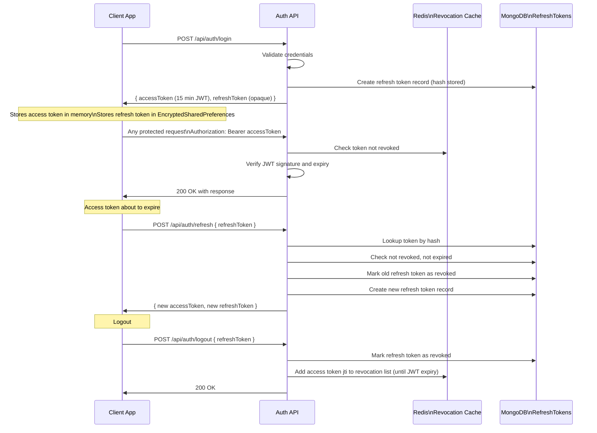

---

## 11. Model lifecycle diagram

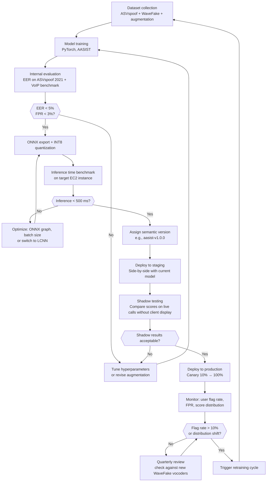
