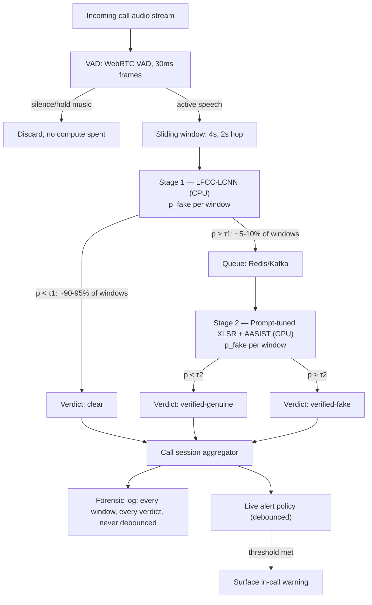
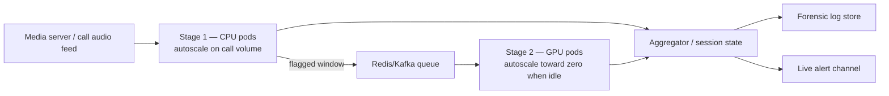

# RingWave Audio Deepfake Detection — Architecture Specification

**Version:** 1.0
**Scope:** Two-stage cascade detector for RingWave (audio calling, India/Hindi deployment)
**Inputs synthesized:** ChatGPT deep-research report, Gemini deep-research report, prior Claude report, DeepSeek draft architecture
**Status of claims below:** every model/paper named here was verified against current literature while writing this doc (citations in §17). Anything not independently verifiable is explicitly flagged as such — don't trust unflagged numbers blindly either; re-verify against your own eval set once you have one.

---

## 0. How to Read This Document

This is not a literature review. It's a build spec. Section 3 is the part you skim once — it tells you what was wrong in the DeepSeek draft and why this document differs from all four inputs. Sections 4–13 are what you implement from. Section 16 is a short list of things that are genuinely open questions — don't let anyone (including this document) pretend they're settled.

---

## 1. Executive Summary

All four input documents agree on the macro shape, and they're right to: **a lightweight high-recall filter (Stage 1) gates a heavyweight high-precision verifier (Stage 2), so the expensive model only ever sees the ~5–10% of traffic that looks suspicious.** That part is not in dispute and doesn't need re-litigating.

What *is* wrong, underspecified, or risky in the source material:

| Issue | Found in | Fix in this doc |
|---|---|---|
| AASIST head fed a single pooled vector instead of the frame-level sequence it was designed for | DeepSeek (§4.1.3, self-admitted "non-trivial") | §6.3 — feed AASIST the full `(B, T, 64)` sequence, unmodified backend |
| RawNetLite's actual published architecture invented/embellished (SincConv front-end, attention pooling) that isn't in the real paper | DeepSeek (§3.1) | §5 — real RawNetLite is conv+3 resblocks+avgpool+BiGRU; we use LFCC-LCNN instead anyway, for reasons below |
| Stage 2 backend (WPT-XLSR-AASIST) validated on an *all-type* benchmark (speech+singing+music+sound), not speech-only | Gemini, prior Claude report (flagged but not resolved), DeepSeek (silently inherited) | §6 — speech-only PT front-end, with a documented, validated speech-specific upgrade path |
| Generic LLM fine-tuning cost figures ($15–80 for "4–9B" models) applied to an audio SSL encoder, sourced from unrelated LLM-economics blog posts | Gemini | Dropped. Irrelevant to this system; conflates LLM pretraining economics with PEFT cost on a 300M speech encoder. |
| Confident single-number latency claims (`<50ms`, `<65ms` total) for a 300M-parameter transformer on commodity GPUs, presented as fact rather than something to benchmark | DeepSeek | §12.3 — given as a range, flagged as "benchmark before you commit to an SLA" |
| No Indic-specific encoder considered — XLSR-53 treats Hindi as 1 of 53 languages | All four | §6.1 — IndicWav2Vec (AI4Bharat, 40 Indian languages, MIT-licensed) added as the primary ablation target |
| No live-call session/streaming logic — windows get a verdict, but nothing about *when to actually interrupt a phone call* | All four | §7 — debounced alert policy, separate from the forensic record |
| Zero-padding short windows | DeepSeek | §4 — adaptive pooling handles variable-length windows natively, no synthetic silence artifact |

The rest of this document is the corrected, decisive version. Where there's a real open empirical question (not a research gap, an actual "we don't know until we measure" question), it's marked as a Phase 2 ablation, not buried as a false certainty.

---

## 2. System Architecture



Both stages run server-side, inside RingWave's own infrastructure — no edge/cloud boundary to secure, which simplifies the deployment story considerably (this is consistent across all four source documents and is the right call given the architecture).

---

## 3. Critical Review of Inputs

### 3.1 DeepSeek's draft — specific, fixable errors

**The AASIST bridging problem (the most important fix in this whole document).** DeepSeek's own text acknowledges this is shaky: it takes the WPT front-end's *single pooled prompt-token embedding* (a `(B, 1024)` vector) and proposes reshaping it into a fake `32×32` "spectrogram" to feed AASIST's dual-graph attention layers. There is no published precedent for this, and it isn't necessary. Every real SSL+AASIST system in the literature (XLSR-AASIST, WavLM-AASIST, SSL-AASIST) feeds AASIST the **full frame-level hidden-state sequence** from the SSL encoder — i.e., it replaces AASIST's own sinc-conv front-end with the SSL encoder's output, keeping the *shape* the graph layers expect (`channels × time`) intact. One paper benchmarking this exact substitution found that swapping in a frozen XLS-R 300M front-end (full sequence, not pooled) dropped EER from 27.6% to ~21.7% relative to AASIST's native front-end on ASVspoof 5, and frozen outperformed fine-tuned in the data-constrained regime. DeepSeek's pooled-vector hack throws away exactly the temporal structure AASIST's graph attention exists to exploit. §6.3 fixes this with the standard approach.

**RawNetLite's architecture, as published, does not match DeepSeek's spec.** The real paper (Di Pierno et al., 2025) describes RawNetLite as "*a 1D convolutional layer, three residual blocks, adaptive average pooling, a bidirectional GRU, and fully connected layers*" — full stop. DeepSeek's version adds a `SincConv_fast` front-end, three pairs of residual blocks (six total) with explicit per-layer shape annotations, and "temporal attention pooling" instead of the paper's adaptive average pooling. None of that extra specificity is sourced — it reads precise, but precision isn't the same as accuracy. The real paper's actual numbers, also correctly carried over by the prior Claude report, are 99.7% F1 / 0.25% EER in-domain (FakeOrReal) collapsing to 83.4% F1 / 16.4% EER out-of-domain (AVSpoof2021+CodecFake) — a large generalization gap that should make you nervous about treating *any* small raw-waveform model's in-domain number as a deployment estimate. This document doesn't use RawNetLite for Stage 1 at all (see §5 for why), but if you do reach for it later, build from the real spec, not DeepSeek's.

**WPT-XLSR-AASIST is real, but it's the wrong benchmark to anchor on.** The 3.58% EER figure DeepSeek (and Gemini, and the prior Claude report) cite is real — it's from "Detect All-Type Deepfake Audio: Wavelet Prompt Tuning for Enhanced Auditory Perception" (Xuan et al., arXiv:2504.06753) — but that number is an *average across speech, singing, music, and environmental-sound deepfakes combined*, because the paper's whole point is cross-type generalization. RingWave only ever sees speech. A detector tuned for cross-type invariance is solving a harder, more general problem than yours, which is not free — generality usually costs some speech-specific accuracy. There's a more relevant, more recent descendant of the same wavelet-prompt idea built specifically for speech: **WaveSP-Net** (Xuan et al., arXiv:2510.05305, ICASSP 2026), which pairs a `Partial-WSPT-XLSR` front-end with a bidirectional Mamba back-end and is validated on Deepfake-Eval-2024 and SpoofCeleb — both modern, in-the-wild, speech-only benchmarks, reported to outperform prior SOTA single systems on both. This is the better reference point for your use case, and §6.5 explains why we don't go all the way to copying it for v1 anyway (Mamba's CUDA-kernel dependency is real implementation risk for limited engineering bandwidth).

**Latency claims need a "verify before you trust" flag.** "<50ms on T4/A10 INT8" and "<65ms total" are presented as settled facts. A 300M-parameter transformer, even frozen, run with per-window batching, is a genuinely variable-latency thing depending on batch size, precision (fp16 vs INT8 — and INT8-quantizing attention layers is *not* always lossless), and whether you're paying cold-start cost on a scale-to-zero GPU pod. Treat DeepSeek's numbers as an optimistic target, not a spec.

### 3.2 The other three reports — what's good, what's missing

**ChatGPT report:** solid, well-cited general landscape (LCNN, AASIST, Nes2Net, the sub-1K-parameter "Green AI" result, the fine-tuning-beats-scratch consensus for SSL encoders). Entirely generic — no RingWave specifics, no Hindi, no telephony, no deployment detail. Useful as background, not actionable on its own.

**Gemini report:** the widest net of any of the four — it surfaced WPT-XLSR-AASIST, TRACE (training-free partial-deepfake localization via frozen-embedding trajectory dynamics — real, verified: arXiv:2604.01083, 8.08% EER on PartialSpoof, beats a supervised baseline on the harder LlamaPartialSpoof set), and the 159K-parameter resolution-aware CNN (arXiv:2601.06560, also real — see §5.3 for why we don't make it the default). But as delivered it's largely a raw research-agent trace: search-result dumps, "I am now investigating X" narration, and a real category error (citing generic LLM fine-tuning cost blog posts — Galileo AI, Red Marble AI, Founder Reality — as if they transfer directly to audio SSL economics; they don't, the unit economics of pretraining-scale LLM compute and a 300M speech encoder's PEFT run aren't comparable in the way the citation implies). The actual signal in it is good; it just needed the synthesis pass this document is doing.

**Prior Claude report:** the strongest strategic framing of the four — correctly reframes the cascade as a cost-control mechanism rather than a latency trick, correctly flags Stage 1 as the system's actual security weak point (an attacker who evades the cheap filter never reaches the expensive one), correctly distrusts ASVspoof 2019 as stale. But it stops at the recommendation-report level: no layer-by-layer specs, no resolved encoder choice between XLSR-53 and an Indic-specific alternative, no streaming/session logic, no repo structure. This document is, in effect, that report's engineering follow-through.

---

## 4. Stage 0 — Preprocessing & Windowing

Consensus across all four sources, and correct: **4-second windows, 50% overlap (2s hop)**, gated by VAD so silence and hold music never reach either model.

```python
import torch
import torchaudio
import webrtcvad

SAMPLE_RATE = 16_000
WINDOW_SAMPLES = 4 * SAMPLE_RATE      # 64,000
HOP_SAMPLES = 2 * SAMPLE_RATE         # 32,000
MIN_WINDOW_SAMPLES = int(1.5 * SAMPLE_RATE)  # shortest window we'll still score

def resample_to_16k(waveform: torch.Tensor, orig_sr: int) -> torch.Tensor:
    """Telephony audio (commonly 8kHz) is upsampled; wideband audio is
    downsampled. Single normalized rate downstream regardless of call leg."""
    if orig_sr == SAMPLE_RATE:
        return waveform
    return torchaudio.functional.resample(waveform, orig_sr, SAMPLE_RATE)

def normalize_window(window: torch.Tensor) -> torch.Tensor:
    window = window - window.mean()                 # remove DC offset
    peak = window.abs().max().clamp(min=1e-6)
    return window * (0.95 / peak)                    # peak-normalize to 0.95

class VADGate:
    """30ms-frame WebRTC VAD. aggressiveness 0-3; 2 is a reasonable default
    for telephony (more aggressive = more silence rejected, more risk of
    clipping low-energy speech onsets — tune against your own call data)."""
    def __init__(self, aggressiveness: int = 2):
        self.vad = webrtcvad.Vad(aggressiveness)
        self.frame_samples = int(SAMPLE_RATE * 0.03)  # 480 samples @ 16kHz

    def speech_mask(self, waveform_i16_bytes: bytes) -> list[bool]:
        n_frames = len(waveform_i16_bytes) // (2 * self.frame_samples)
        out = []
        for i in range(n_frames):
            frame = waveform_i16_bytes[i * 2 * self.frame_samples:(i + 1) * 2 * self.frame_samples]
            out.append(self.vad.is_speech(frame, SAMPLE_RATE))
        return out

def sliding_windows(active_speech: torch.Tensor):
    """Yields (window_tensor, start_sample, end_sample). Windows shorter than
    MIN_WINDOW_SAMPLES at the tail of a call are dropped, not zero-padded —
    zero-padding teaches the model an artificial "hard silence" boundary it
    will never see in production and can itself become a spurious cue.
    Windows between MIN_WINDOW_SAMPLES and WINDOW_SAMPLES are scored as-is;
    both Stage 1 and Stage 2 below are built to accept variable-length input."""
    n = active_speech.shape[-1]
    if n < MIN_WINDOW_SAMPLES:
        return
    start = 0
    while start < n:
        end = min(start + WINDOW_SAMPLES, n)
        if end - start >= MIN_WINDOW_SAMPLES:
            yield normalize_window(active_speech[..., start:end]), start, end
        if end == n:
            break
        start += HOP_SAMPLES
```

`webrtcvad` requires 16-bit PCM mono at 8/16/32/48kHz — convert from float tensors accordingly in your actual ingestion path; the sketch above assumes you've already done that conversion at the call-leg boundary.

---

## 5. Stage 1 — High-Recall Filter

### 5.1 Architecture decision: LFCC + LCNN, not a raw-waveform net

Three real candidates surfaced across the four inputs:

| Candidate | Params | Why / why not |
|---|---|---|
| **LFCC + LCNN** (this doc's choice) | ~0.2–0.6M | The classic ASVspoof anti-spoofing baseline architecture, in continuous production-grade use for years. LFCC's linear (not mel) frequency scale preserves high-frequency vocoder/codec artifacts that mel-scale compression tends to smear — exactly the signal a cheap filter needs. Feature extraction is a single FFT-based transform, cheaper than running any neural front-end before the classifier even starts. |
| RawNetLite (real spec, §3.1) | ~tens of K–low hundreds of K, paper doesn't state exact count | Zero feature engineering, genuinely good in-domain numbers — but the published 16.4% EER out-of-domain figure is a real, sourced warning about generalization, and it operates on 64,000 raw samples per window vs. LFCC-LCNN's compact ~400×60 feature map, so it's the more expensive of the two to run on every window of every call on CPU. |
| Resolution-aware cross-scale-attention CNN (arXiv:2601.06560) | 159K, <1 GFLOP | Genuinely strong reported numbers (EER 0.16% ASVspoof-LA, 4.81% EER / 0.98 AUC in-the-wild) and tiny footprint — but it's a single-author January-2026 preprint with no independent reproduction yet found. Worth a serious Phase 2 evaluation slot (§15), not a default you bet a live calling product on sight-unseen. |

LFCC-LCNN is the boring, proven choice, which is exactly what you want a component to be when its only job is "run on 100% of traffic, cheaply, and almost never miss a fake."

### 5.2 Feature extraction

60-dim static LFCC + delta + delta-delta, stacked as 3 channels (the standard ASVspoof LCNN convention — treats the three coefficient streams the way an image model treats RGB channels):

```python
class LFCCFrontend(nn.Module):
    def __init__(self, sample_rate=16_000, n_lfcc=60, win_length=400, hop_length=160):
        super().__init__()
        self.lfcc = torchaudio.transforms.LFCC(
            sample_rate=sample_rate,
            n_filter=128,
            n_lfcc=n_lfcc,
            speckwargs={"n_fft": 512, "win_length": win_length, "hop_length": hop_length},
        )

    def forward(self, waveform: torch.Tensor) -> torch.Tensor:
        # waveform: (B, num_samples) -> (B, 3, T, n_lfcc)
        feat = self.lfcc(waveform)                          # (B, n_lfcc, T)
        d1 = torchaudio.functional.compute_deltas(feat)
        d2 = torchaudio.functional.compute_deltas(d1)
        stacked = torch.stack([feat, d1, d2], dim=1)         # (B, 3, n_lfcc, T)
        return stacked.transpose(2, 3)                        # (B, 3, T, n_lfcc)
```

25ms frame / 10ms hop gives ~398 frames for a full 4s window; shorter tail windows simply produce fewer frames, which the adaptive pooling below absorbs without padding.

### 5.3 Model: LFCC-LCNN with Max-Feature-Map activation

```python
class MFM(nn.Module):
    """Max-Feature-Map (Wu et al.): split channels in half, take the
    elementwise max. Halves channel count; acts as a learned competitive
    nonlinearity in place of ReLU. Standard in every LCNN variant."""
    def __init__(self, dim=1):
        super().__init__()
        self.dim = dim

    def forward(self, x):
        a, b = torch.chunk(x, 2, dim=self.dim)
        return torch.max(a, b)

class ConvMFM(nn.Module):
    def __init__(self, in_ch, out_ch, kernel_size, padding=0, use_bn=False):
        super().__init__()
        self.conv = nn.Conv2d(in_ch, out_ch, kernel_size, padding=padding)
        self.mfm = MFM(dim=1)
        self.bn = nn.BatchNorm2d(out_ch // 2) if use_bn else nn.Identity()

    def forward(self, x):
        return self.bn(self.mfm(self.conv(x)))

class Stage1LCNN(nn.Module):
    """Input: (B, 3, T, 60) LFCC+delta+delta2. Output: (B,) raw logit
    (use BCEWithLogitsLoss, not a sigmoid baked into the model)."""
    def __init__(self):
        super().__init__()
        self.block1 = ConvMFM(3, 64, 5, padding=2)                  # -> 32ch
        self.pool1 = nn.MaxPool2d(2, 2)
        self.block2 = ConvMFM(32, 64, 1)                            # -> 32ch
        self.block3 = ConvMFM(32, 96, 3, padding=1, use_bn=True)    # -> 48ch
        self.pool2 = nn.MaxPool2d(2, 2)
        self.block4 = ConvMFM(48, 96, 1, use_bn=True)               # -> 48ch
        self.block5 = ConvMFM(48, 128, 3, padding=1)                # -> 64ch
        self.pool3 = nn.MaxPool2d(2, 2)
        self.block6 = ConvMFM(64, 128, 1, use_bn=True)              # -> 64ch
        self.block7 = ConvMFM(64, 64, 3, padding=1, use_bn=True)    # -> 32ch
        self.block8 = ConvMFM(32, 64, 1, use_bn=True)               # -> 32ch
        self.block9 = ConvMFM(32, 64, 3, padding=1)                 # -> 32ch
        # Adaptive pool, not a fixed flatten -- this is what lets variable-
        # length tail windows (see §4) skip zero-padding entirely.
        self.gap = nn.AdaptiveAvgPool2d((4, 4))
        self.fc1 = nn.Linear(32 * 4 * 4, 160)
        self.mfm_fc = MFM(dim=1)
        self.dropout = nn.Dropout(0.5)
        self.fc2 = nn.Linear(80, 1)

    def forward(self, x):
        x = self.pool1(self.block1(x))
        x = self.block2(x)
        x = self.pool2(self.block3(x))
        x = self.block4(x)
        x = self.pool3(self.block5(x))
        x = self.block6(x)
        x = self.block7(x)
        x = self.block8(x)
        x = self.block9(x)
        x = self.gap(x).flatten(1)
        x = self.mfm_fc(self.fc1(x))
        x = self.dropout(x)
        return self.fc2(x).squeeze(-1)
```

Parameter count for this exact spec is in the low hundreds of thousands — verify with `sum(p.numel() for p in model.parameters())` once instantiated rather than trusting any number quoted in a document (including this one).

### 5.4 Training

- **Loss:** `BCEWithLogitsLoss(pos_weight=num_real/num_fake)` as the default; swap to focal loss (`γ=2`) if validation shows the model plateauing on hard, heavily-degraded fakes specifically — don't reach for focal loss by default, it's a fix for a symptom you should confirm you have first.
- **Optimizer:** AdamW, lr=1e-4, weight_decay=1e-5, batch_size=32–64.
- **Scheduler:** CosineAnnealingWarmRestarts, T_0=20 epochs.
- **Early stopping:** monitor validation EER, patience 15 epochs.
- **From scratch, not fine-tuned** — cheap to retrain, full control of the training distribution, no inherited bias from a public checkpoint trained on a different language/channel mix. Retrain on a weekly/biweekly cadence as confirmed false positives/negatives accumulate from production (§9, hard-negative loop).
- **Augmentation (non-negotiable, applied on the fly):** codec sim (μ-law, GSM, Opus @6kbps), 300–3400Hz bandpass, background noise injection (5–25dB SNR), time-stretch ±10%, pitch-shift ±200 cents, RIR convolution (small room / car cabin). Implement with `torch-audiomentations` or `audiomentations`.

### 5.5 Threshold strategy

`τ1` is a runtime config value, not a constant baked into the model. Launch at `τ1 = 0.05`, targeting ~7–10% flag rate; this is a starting point to be corrected against real traffic, not a number to defend (§8).

### 5.6 Optional hardening (Phase 2, not MVP): heterogeneous ensemble

Section 3.2 flags Stage 1 as the system's actual point of failure for recall — an attacker who evades the cheap filter never reaches Stage 2 at all. A cheap mitigation once you have bandwidth: run a *second*, architecturally different lightweight model (e.g., a real RawNetLite per the corrected §3.1 spec) alongside the LCNN, and flag if *either* model exceeds its threshold (OR logic — preserves recall, doesn't reduce it). Both models combined are still sub-1M parameters total; the value isn't accuracy, it's that an adversarial perturbation crafted against one architecture's specific decision boundary is much less likely to also fool a structurally different one. Don't build this for v1 — it's real engineering and ops overhead (two models to version, two training pipelines) for a problem you haven't measured yet.

---

## 6. Stage 2 — High-Precision Verifier

### 6.1 Encoder choice: XLSR-53 by default, IndicWav2Vec as the named ablation

| Encoder | Coverage | Validated for anti-spoofing? |
|---|---|---|
| **wav2vec2-XLSR-53** (`facebook/wav2vec2-large-xlsr-53`) | 53 languages, Hindi is one of them | Yes — this is the encoder used across nearly every SSL-AASIST / SSL-anti-spoofing paper found while writing this doc. Safe default. |
| **IndicWav2Vec** (`AI4Bharat/IndicWav2Vec`, MIT-licensed) | 40 Indian languages specifically, including Hindi — far deeper Hindi/Indic acoustic exposure than XLSR-53 gets as 1-of-53 | Not validated for anti-spoofing in any paper found. Unproven specifically for *this* task, even though its linguistic alignment is better on paper. |

This is a genuine, unresolved empirical question, not a hedge: ship Stage 2 v1 on XLSR-53 (the safe, validated choice — matches the prior research direction already settled on for RingWave), and run IndicWav2Vec as a parallel Phase 2 ablation once you have a labeled Hindi eval set large enough to tell the two apart. Whichever wins on your actual Hindi/Hinglish/telephony validation data is the one that ships. Don't guess past that point — it really is an open question.

### 6.2 Front-end: prompt tuning, not full fine-tuning

Full fine-tuning a 300M-parameter encoder on the small labeled Hindi-deepfake dataset you'll have early on risks overfitting badly and burns far more compute than necessary. Parameter-efficient prompt tuning — inject a small number of learnable prompt vectors at every transformer layer, keep the backbone entirely frozen — is the right call here, and is well-supported in the literature (the WPT-XLSR-AASIST paper reports 458× fewer trainable parameters than full fine-tuning while still reaching SOTA on its benchmark).

```python
from transformers import Wav2Vec2Model

def build_haar_pair(n_prompts: int):
    """Fixed (non-trainable) Haar low/high-pass matrices, used only if
    use_wavelet_prompts=True. n_prompts must be even."""
    h = torch.zeros(n_prompts // 2, n_prompts)
    g = torch.zeros(n_prompts // 2, n_prompts)
    for i in range(n_prompts // 2):
        h[i, 2*i] = h[i, 2*i+1] = 2 ** -0.5
        g[i, 2*i], g[i, 2*i+1] = 2 ** -0.5, -2 ** -0.5
    return h, g

class PromptedEncoder(nn.Module):
    """Frozen SSL encoder (XLSR-53 or IndicWav2Vec) with deep prompt tuning:
    fresh learnable prompts are prepended at *every* layer's input and
    stripped before the next layer, rather than accumulating sequence
    length across the stack (the "VPT-deep" / P-tuning-v2 pattern).

    use_wavelet_prompts=True adds the wavelet-decomposed variants from the
    WPT/WaveSP line of work, which the literature shows helps even for
    pure-speech detection, not just cross-type — it's a genuine accuracy
    lever, not just cross-type baggage. Off by default for the v1 to keep
    the first working version simple; turn on once the plain version is
    validated end-to-end.
    """
    def __init__(self, model_name="facebook/wav2vec2-large-xlsr-53",
                 n_prompts=10, use_wavelet_prompts=False, hidden=1024):
        super().__init__()
        self.encoder = Wav2Vec2Model.from_pretrained(model_name)
        for p in self.encoder.parameters():
            p.requires_grad = False
        self.encoder.eval()

        n_layers = self.encoder.config.num_hidden_layers
        self.prompts = nn.Parameter(torch.randn(n_layers, n_prompts, hidden) * 0.02)
        self.use_wavelet_prompts = use_wavelet_prompts
        if use_wavelet_prompts:
            h, g = build_haar_pair(n_prompts)
            self.register_buffer("haar_low", h)
            self.register_buffer("haar_high", g)

        self._n_tokens_per_layer = None  # set by hooks below
        self._register_hooks()

    def _register_hooks(self):
        layers = self.encoder.encoder.layers

        def make_pre_hook(i):
            def pre_hook(module, args, kwargs):
                hidden_states = args[0]
                prompt = self.prompts[i].unsqueeze(0).expand(hidden_states.size(0), -1, -1)
                tokens = [prompt]
                if self.use_wavelet_prompts:
                    tokens.append((self.haar_low @ self.prompts[i]).unsqueeze(0)
                                  .expand(hidden_states.size(0), -1, -1))
                    tokens.append((self.haar_high @ self.prompts[i]).unsqueeze(0)
                                  .expand(hidden_states.size(0), -1, -1))
                full_prompt = torch.cat(tokens, dim=1)
                self._n_tokens_per_layer = full_prompt.size(1)
                new_hidden = torch.cat([full_prompt, hidden_states], dim=1)
                return (new_hidden,) + args[1:], kwargs
            return pre_hook

        def make_post_hook():
            def post_hook(module, args, output):
                hidden_states = output[0]
                stripped = hidden_states[:, self._n_tokens_per_layer:, :]
                return (stripped,) + output[1:]
            return post_hook

        for i, layer in enumerate(layers):
            layer.register_forward_pre_hook(make_pre_hook(i), with_kwargs=True)
            layer.register_forward_hook(make_post_hook())

    def forward(self, waveform: torch.Tensor) -> torch.Tensor:
        return self.encoder(waveform).last_hidden_state  # (B, T≈200, 1024)
```

**This needs hands-on validation, not blind trust.** Hook signatures and attention-mask handling differ across `transformers` versions; print shapes at every layer the first time you wire this up, and confirm the attention mask gets extended to cover the prepended prompt positions (or that the encoder layer doesn't require one for your input length — Wav2Vec2's encoder typically doesn't mask for single-utterance batches, but verify against your installed version). This is the honest caveat DeepSeek's draft should have had instead of an unverified confidence.

### 6.3 Backend: AASIST, fed correctly

The fix described in §3.1 — feed AASIST the full frame-level sequence, not a pooled vector:

```python
class Stage2Verifier(nn.Module):
    def __init__(self, encoder: PromptedEncoder, aasist_channels=64):
        super().__init__()
        self.encoder = encoder
        self.adapter = nn.Linear(1024, aasist_channels)  # per-frame projection
        # Port the *unmodified* graph-attention backend from the official
        # AASIST implementation: github.com/clovaai/aasist (Jung et al. 2021,
        # arXiv:2110.01200). Its `Model` class natively expects a
        # (B, channels, time) feature map -- exactly what we hand it below --
        # because that's what its own sinc-conv front-end would have
        # produced. We are *only* replacing the front-end, not the graph
        # layers, GAT, HtrgGAT, pooling, or readout.
        from aasist_backend import AASISTBackend  # vendored from clovaai/aasist
        self.backend = AASISTBackend(in_channels=aasist_channels)

    def forward(self, waveform: torch.Tensor) -> torch.Tensor:
        seq = self.encoder(waveform)        # (B, T, 1024)
        seq = self.adapter(seq)             # (B, T, 64)
        seq = seq.transpose(1, 2)           # (B, 64, T) -- AASIST's native layout
        return self.backend(seq)            # (B,) raw logit
```

### 6.4 Loss function

BCE-with-logits + positive class weighting is a reasonable default, matching DeepSeek's choice. Worth strongly considering as an upgrade: **OC-Softmax** (one-class softmax, Zhang/Yu/Yu — "One-Class Learning Towards Generalized Voice Spoofing Detection") instead of plain BCE/focal loss for Stage 2 specifically. The motivation is structural, not just empirical: genuine speech is a tight, well-sampled class (your own users, recorded in your own telephony conditions); fake speech is an open-ended, ever-expanding class (every new TTS/voice-cloning model that gets released). OC-Softmax is built around exactly that asymmetry — it compacts the genuine-speech embeddings tightly while only pushing fake embeddings *away* from that compact region, rather than treating both classes as symmetric clusters the way BCE implicitly does. This tends to generalize better to attack types not seen during training, which is precisely the failure mode flagged in §3.2 (stale-benchmark risk). Worth an ablation against plain BCE once you have a held-out set of unseen-generator fakes to test generalization on.

### 6.5 What we deliberately did *not* build for v1: WaveSP-Net / Mamba backend

Per §3.1, WaveSP-Net (Partial-WSPT-XLSR front-end + bidirectional Mamba backend) has the most relevant, most recent, speech-specific validation of anything surfaced across all four input documents. It is not the v1 default here for one concrete reason: Mamba-based backends depend on `mamba-ssm`, which requires compiling custom CUDA kernels matched to your exact GPU compute capability and CUDA toolkit version — a real source of environment friction that AASIST's plain PyTorch graph-attention layers don't have. Get the AASIST-backed version working and validated end-to-end first; swapping the backend for a Mamba classifier later is a contained, well-scoped Phase 2 task (§15), not a v1 risk worth taking on top of everything else in this spec.

### 6.6 Training

- AdamW, lr=1e-3 for prompts + adapter + AASIST head only (backbone stays frozen — verify `requires_grad=False` actually held after `.from_pretrained()`, it's a common silent bug to accidentally unfreeze).
- Batch size 8–16, limited by the frozen encoder's activation memory even though it isn't being updated.
- 30–50 epochs, LR × 0.5 on a 5-epoch validation plateau.
- Trains only once you have the labeled Hindi/Indic deepfake data from §9 — there's no meaningful Stage 2 training run before that pipeline exists.

---

## 7. Decision Aggregation, Call-Session Logic & Localization

This is the piece all four input documents skip entirely, and it's the difference between "a classifier" and "a feature in a live calling product."

### 7.1 Per-window verdicts

Each window resolves to one of: `clear` (Stage 1 passed), `verified-genuine` (Stage 1 flagged, Stage 2 cleared), `verified-fake` (Stage 1 flagged, Stage 2 confirmed).

### 7.2 Two separate policies, deliberately not the same logic

**Forensic record (never debounced):** every window's verdict, score, and timestamp range gets logged, full stop. This is the data hard-negative mining (§9.5) and post-call trust & safety review depend on — debouncing the *data* would throw away exactly the signal you need to improve the system.

**Live in-call alert (debounced):** a single flickering `verified-fake` window mid-call should not pop a scary warning in front of a user. Require either (a) two or more `verified-fake` windows within any rolling 10-second span, or (b) one window with `p_fake > 0.9`, before surfacing anything live. This is a UX/trust decision as much as a technical one — tune the exact thresholds against real user feedback, but don't skip having *some* debounce, or you'll train users to ignore the warning.

```python
from collections import deque
from dataclasses import dataclass

@dataclass
class WindowVerdict:
    start_s: float
    end_s: float
    stage: int          # 1 or 2
    label: str          # "clear" | "verified-genuine" | "verified-fake"
    score: float

class CallSession:
    def __init__(self, call_id: str, debounce_window_s: float = 10.0,
                 debounce_count: int = 2, high_confidence: float = 0.9):
        self.call_id = call_id
        self.log: list[WindowVerdict] = []          # forensic record, append-only
        self.recent_fakes: deque = deque()           # for live debounce only
        self.debounce_window_s = debounce_window_s
        self.debounce_count = debounce_count
        self.high_confidence = high_confidence
        self.alert_fired = False

    def record(self, v: WindowVerdict):
        self.log.append(v)
        if v.label == "verified-fake":
            self.recent_fakes.append(v)
            cutoff = v.end_s - self.debounce_window_s
            while self.recent_fakes and self.recent_fakes[0].end_s < cutoff:
                self.recent_fakes.popleft()
            if (len(self.recent_fakes) >= self.debounce_count
                    or v.score > self.high_confidence):
                self._fire_live_alert(v)

    def _fire_live_alert(self, trigger: WindowVerdict):
        if not self.alert_fired:
            self.alert_fired = True
            # surface in-call UI warning, e.g. via the existing RTC signalling channel
        # (left to RingWave's call UI layer to implement)

    def call_level_verdict(self) -> str:
        """Post-call / report-level decision: any confirmed-fake window flags
        the whole call. Do not average scores across windows for this -- a
        short spliced fake diluted into a 'mostly real' average is exactly
        the partial-deepfake failure mode every source document (correctly)
        warns about."""
        return "fake" if any(v.label == "verified-fake" for v in self.log) else "genuine"
```

### 7.3 Optional Phase 2: sub-window localization via TRACE

If you need to pinpoint *where inside* a flagged 4-second window a splice boundary sits (useful for forensic review, less so for the live alert), **TRACE** (Training-free Representation-based Audio Countermeasure via Embedding dynamics, arXiv:2604.01083) is worth prototyping: it's training-free, works off the first-order dynamics of frozen SSL embeddings (genuine speech produces smooth embedding trajectories; splice boundaries produce abrupt jumps), and reports 8.08% EER on PartialSpoof while outperforming a supervised baseline on the harder LLM-generated LlamaPartialSpoof set. Because it needs no training data or labels, it's a cheap thing to try directly against your Stage 2 encoder's frozen activations without building a separate training pipeline. Not required for v1.

---

## 8. Cost Model & Threshold Tuning

```python
def flagged_fraction(prevalence: float, stage1_recall: float, stage1_fpr: float) -> float:
    """Fraction of all windows that reach Stage 2."""
    return prevalence * stage1_recall + (1 - prevalence) * stage1_fpr

def cost_ratio(prevalence: float, stage1_recall: float, stage1_fpr: float,
               cost2_over_cost1: float) -> float:
    """Total cascade cost as a multiple of running Stage 1 alone on
    everything (1.0 = no Stage 2 overhead; cost2_over_cost1+1 = running
    Stage 2 on everything)."""
    ff = flagged_fraction(prevalence, stage1_recall, stage1_fpr)
    return 1.0 + ff * cost2_over_cost1

# worked example matching the consensus numbers across all four source docs:
# prevalence 1.5%, Stage 1 recall 99%, Stage 1 FPR 7%, Stage 2 ~50x Stage 1 cost
ff = flagged_fraction(0.015, 0.99, 0.07)            # ≈ 0.084  (8.4% of traffic)
ratio = cost_ratio(0.015, 0.99, 0.07, 50)           # ≈ 5.2x Stage-1-alone cost
# vs. running Stage 2 on everything: 51x Stage-1-alone cost
# -> roughly a 90% reduction in heavy-model compute, consistent across all
#    four input documents' independent estimates.
```

Real prevalence is unknown until you have production traffic — don't hardcode a guess into the architecture. Launch with the conservative defaults above (`τ1=0.05`, targeting 7–10% flag rate), instrument flag rate and Stage 2 accept/reject rate from day one, and retune weekly against measured numbers, not against EER figures from a paper. If Stage 1's flag rate is causing GPU overload, raise `τ1` *and verify recall doesn't drop* on a held-out test set before shipping the change — never tune the threshold against production cost pressure alone.

**One addition beyond all four source documents:** route a small random sample (e.g. 1%) of windows that Stage 1 did *not* flag to Stage 2 anyway, purely for monitoring. You cannot otherwise measure Stage 1's real-world false-negative rate in production — by construction, windows Stage 1 clears never reach a second opinion. This "shadow sampling" lane is cheap (1% of traffic at Stage 2's cost is a small addition to the ~8% already flagged) and is your only direct signal for whether Stage 1 is quietly leaking fakes, which is exactly the failure mode §3.2 flags as the system's biggest structural risk.

---

## 9. Hindi/Indic Data Strategy

### 9.1 Genuine speech

- **AI4Bharat corpora:** IndicVoice, Shrutilipi, IndicSUPERB/Kathbath (1,684 hours across 12 Indian languages, natural recording conditions).
- **M-AILABS Hindi subset** for clean studio speech as a baseline.
- **In-house, anonymized, consented call recordings** — the highest-value source by far, since it's the only one that carries your actual telephony codec chain and real background-noise distribution.

### 9.2 Synthetic/fake speech

Labeled Hindi deepfake data barely exists publicly, so generate it:

- **XTTS-v2** (Coqui), **Indic Parler-TTS**, and **AI4Bharat's own TTS stack** synthesizing from transcripts of your genuine Hindi clips — produces cloned, natural-sounding fakes paired 1:1 with real speakers.
- **MLAAD** (Multi-Language Audio Anti-Spoofing Dataset, ~119 TTS systems across 40 languages) — incorporate its Hindi slice directly.
- If API access is available, a subset of zero-shot cloning via commercial systems (ElevenLabs-class) for the highest-fidelity attack samples — these are the attacks most likely to defeat a detector trained only on older open-source TTS, per the stale-benchmark warning in §3.2.

### 9.3 Augmentation (applied to everything, real and fake, not optional)

Resample 16→8→16kHz (narrowband simulation), codec compression (Opus @6kbps, GSM, G.711 μ-law), 300–3400Hz bandpass, background noise at 5–25dB SNR, time-stretch ±10%, pitch-shift ±200 cents, RIR convolution (office/car cabin). A model trained only on clean studio audio will look excellent in validation and fail on real calls — this is the single most repeated warning across all four source documents, and it's correct.

### 9.4 Splits

80% train / 10% validation (used to tune τ1 and τ2) / 10% held-out test, with the test set specifically including attacks from generators **not used during training** — this is what actually measures generalization rather than memorization, and it's the split structure that catches the ASVspoof-2019-style staleness problem before it reaches production.

### 9.5 Hard-negative feedback loop

Stage 2's confirmed verdicts (especially confirmed false positives and any confirmed-fake window Stage 1 almost missed — i.e., scored just under `τ1`) feed back into the next Stage 1 retraining cycle. Combined with the shadow-sampling lane from §8, this is how Stage 1 actually tightens over time instead of drifting stale against new attack types.

### 9.6 Bootstrap note

Stage 2 isn't starting from zero on Hindi even before any Hindi-labeled data exists: XLSR-53 was pretrained on multilingual audio that includes Hindi, so cross-lingual transfer gives a usable starting point for prompt-tuning the head while the Hindi-specific data pipeline above is still being built. Ship v1 on that transfer; layer in Hindi-specific labeled data as §9.1–9.2 produce it, and only then run the IndicWav2Vec ablation from §6.1 — that comparison is only meaningful once there's enough Hindi data to actually discriminate between the two encoders.

---

## 10. Evaluation Protocol

- **Primary metric:** EER, reported separately per language (Hindi / English / Hinglish code-switch), per audio condition (clean / telephony-degraded), and per attack generator — a single blended EER number hides exactly the failure modes that matter (e.g., a model that's great on English-clean and mediocre on Hindi-telephony can still post a deceptively good aggregate number).
- **Secondary:** F1, recall at a fixed operating precision, and flag-rate/accept-rate as tracked in §8.
- **Generalization test:** the held-out-generator test set from §9.4, re-run periodically as new TTS/voice-cloning tools become available — treat this as a recurring task, not a one-time validation.
- **Adversarial red-teaming for Stage 1 specifically:** since Stage 1 is the system's actual point of failure for recall (§3.2), it needs its own adversarial evaluation — simulate an attacker with white-box access to *just* Stage 1's architecture (a realistic threat model, since Stage 1 is the cheaper, more likely component to leak or be reverse-engineered) and confirm Stage 1's recall holds up against perturbations optimized specifically to slip under its threshold. Accuracy on a clean test set says nothing about this.
- **Latency/throughput:** benchmark on your actual target hardware before committing to any SLA — see the explicit caveat in §3.1 about not trusting confident single-number latency claims without measurement.

---

## 11. Deployment Architecture



- **Stage 1:** Kubernetes Deployment, CPU-only, TorchScript- or ONNX-compiled, autoscaled on CPU/call-volume. Cheap enough to genuinely run on every window of every call.
- **Stage 2:** separate Deployment on GPU nodes, autoscaled toward zero when the queue is empty — this is the entire point of the cascade from a cost standpoint, so make sure the autoscaling policy actually scales to zero rather than keeping a warm minimum replica count "just in case," which quietly defeats the savings.
- **Inter-stage communication:** gRPC with protobuf for low-latency binary audio transfer; a queue (Redis Streams or Kafka) decouples Stage 1's throughput from Stage 2's, so a burst of flagged windows doesn't backpressure Stage 1.
- **Quantization:** INT8 + ONNX export for Stage 1 is low-risk (small model, well within INT8's accuracy tolerance). For Stage 2, start with fp16 rather than committing to INT8 — quantizing a 24-layer transformer's attention blocks to INT8 can introduce real accuracy loss depending on calibration quality, and you're already paying the GPU cost on only ~8% of traffic, so the marginal savings from the riskier INT8 path are smaller than for Stage 1.

### 11.1 Latency budget (treat as a target, not a guarantee — see §3.1)

| Step | Estimate |
|---|---|
| VAD + windowing | ~5ms |
| Stage 1 inference (CPU) | <5–15ms |
| Queue hop to Stage 2 | ~5–20ms |
| Stage 2 inference (GPU, fp16, batched) | ~30–100ms — benchmark this specifically |
| Aggregation | negligible |
| **Total, flagged window** | **roughly 50–140ms** — wide range deliberately, narrow it with your own benchmark |
| **Total, non-flagged window** | **~10–25ms** |

---

## 12. Repository Structure

```
ringwave_deepfake/
├── audio/
│   ├── vad.py                 # WebRTC VAD wrapper (§4)
│   ├── windowing.py           # sliding window + normalization (§4)
│   └── features.py            # LFCCFrontend (§5.2)
├── models/
│   ├── mfm.py                 # MFM activation (§5.3)
│   ├── stage1_lcnn.py         # Stage1LCNN (§5.3)
│   ├── stage2_encoder.py      # PromptedEncoder + Haar prompts (§6.2)
│   └── stage2_verifier.py     # Stage2Verifier + AASIST adapter (§6.3)
├── training/
│   ├── train_stage1.py
│   ├── train_stage2.py
│   ├── datasets.py
│   ├── augment.py             # codec/noise/RIR pipeline (§9.3)
│   └── losses.py              # BCE/focal/OC-Softmax (§6.4)
├── inference/
│   ├── pipeline.py            # end-to-end window -> verdict
│   └── session.py             # CallSession, debounce policy (§7.2)
├── data/
│   ├── ai4bharat_download.py
│   ├── tts_fake_generation.py # XTTS-v2 / Indic Parler-TTS (§9.2)
│   └── mlaad_prep.py
├── eval/
│   ├── eer.py
│   ├── breakdown.py           # per-language/condition/generator splits (§10)
│   └── adversarial_redteam.py # Stage 1 white-box probing (§10)
├── serving/
│   ├── stage1_service.py      # CPU, FastAPI/gRPC
│   ├── stage2_service.py      # GPU, FastAPI/gRPC, autoscale-to-zero
│   └── router.py
└── configs/
    ├── stage1.yaml            # τ1, augmentation params, training hparams
    └── stage2.yaml            # encoder choice (xlsr53 | indicwav2vec), τ2, PEFT hparams
```

---

## 13. Risks & Operational Watchpoints

- **Stage 1 is the single point of failure for recall.** Repeated for emphasis because it's the most important operational fact in this whole system: an attack tuned specifically to slip under the cheap filter never reaches Stage 2. The shadow-sampling lane (§8) and dedicated adversarial red-teaming (§10) are not optional extras — they're how you'd actually notice this happening.
- **Two models to keep versioned and in sync**, with the hard-negative feedback loop (§9.5) as an explicit, scheduled process, not something that happens by accident.
- **Stale benchmarks give false confidence.** Re-validate against current in-the-wild and codec-augmented data on a recurring cadence, not just at launch — voice-cloning tools improve faster than most academic benchmarks update.
- **The encoder-choice question (§6.1) and the Mamba-backend question (§6.5) are both genuinely open.** Don't let either calcify into "the architecture" before you've actually run the comparison your own data can support.

---

## 14. Phased Roadmap

1. **Phase 1 (MVP):** Stage 1 (LFCC-LCNN, from scratch) + Stage 2 (XLSR-53, plain prompt tuning, AASIST backend fed correctly per §6.3) + windowing/VAD + the `CallSession` aggregation logic from §7. Launch with conservative thresholds, instrument everything.
2. **Phase 2a:** Hindi data pipeline (§9) at full scale; hard-negative loop running on a real cadence; IndicWav2Vec ablation once there's enough labeled Hindi data to discriminate the two encoders.
3. **Phase 2b:** wavelet prompts (`use_wavelet_prompts=True`) and OC-Softmax loss ablations on Stage 2, once the plain version is stable.
4. **Phase 3:** Stage 1 heterogeneous ensemble (§5.6) and/or resolution-aware-CNN evaluation (§5.1) if Stage 1 recall under adversarial testing isn't where you need it.
5. **Phase 3:** WaveSP-Net / Mamba backend swap-in (§6.5) and TRACE-based sub-window localization (§7.3), once core infra is stable and there's bandwidth for the added implementation complexity.

---

## 15. Open Questions to Validate Empirically

These are real unknowns, not modesty:

- XLSR-53 vs. IndicWav2Vec for Hindi/Indic anti-spoofing — no paper answers this; it has to be measured on your data.
- Whether wavelet-decomposed prompts (vs. plain prompt tuning) earn their added complexity on a speech-only, telephony-degraded task specifically — WaveSP-Net's numbers are on Deepfake-Eval-2024/SpoofCeleb, not your exact data distribution.
- Real fake-call prevalence in RingWave traffic — currently unknown, everything in §8 is a placeholder until you have weeks of real flag-rate data.
- Whether the 159K-parameter resolution-aware CNN's strong reported numbers (§5.1) reproduce outside its original single-author evaluation.

---

## 16. References

- Jung et al., "AASIST: Audio Anti-Spoofing Using Integrated Spectro-Temporal Graph Attention Networks," arXiv:2110.01200. Official implementation: github.com/clovaai/aasist.
- Xuan et al., "Detect All-Type Deepfake Audio: Wavelet Prompt Tuning for Enhanced Auditory Perception," arXiv:2504.06753.
- Xuan et al., "WaveSP-Net: Learnable Wavelet-Domain Sparse Prompt Tuning for Speech Deepfake Detection," arXiv:2510.05305 (ICASSP 2026).
- Di Pierno et al., "End-to-end Audio Deepfake Detection from RAW Waveforms: a RawNet-Based Approach with Cross-Dataset Evaluation," arXiv:2504.20923.
- Shahriar, "Lightweight Resolution-Aware Audio Deepfake Detection via Cross-Scale Attention and Consistency Learning," arXiv:2601.06560.
- "TRACE: Training-Free Partial Audio Deepfake Detection via Embedding Trajectory Analysis of Speech Foundation Models," arXiv:2604.01083.
- "Towards Scalable AASIST: Refining Graph Attention for Speech Deepfake Detection," arXiv:2507.11777 (frozen vs. fine-tuned XLS-R front-end comparison on ASVspoof 5).
- AI4Bharat, IndicWav2Vec — github.com/AI4Bharat/IndicWav2Vec; IndicSUPERB/Kathbath, arXiv:2208.11761.
- Zhang, Yu, Yu, "One-Class Learning Towards Generalized Voice Spoofing Detection" (OC-Softmax).
- MLAAD — Multi-Language Audio Anti-Spoofing Dataset.
